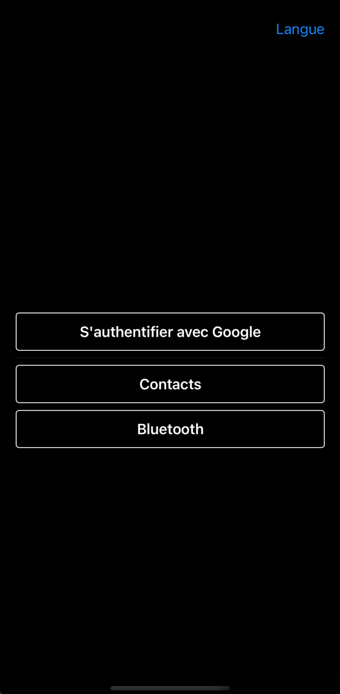
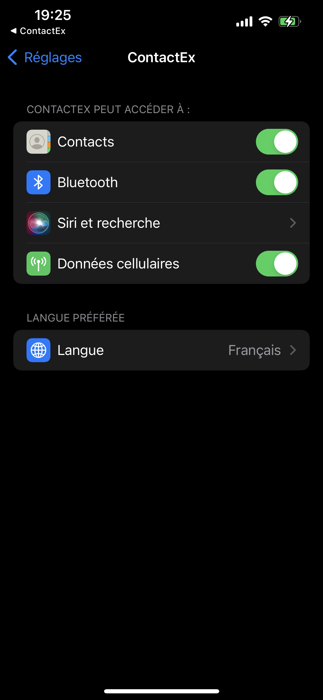
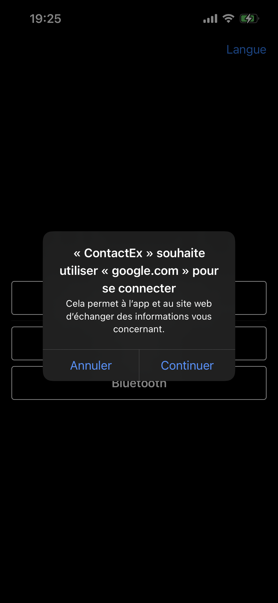
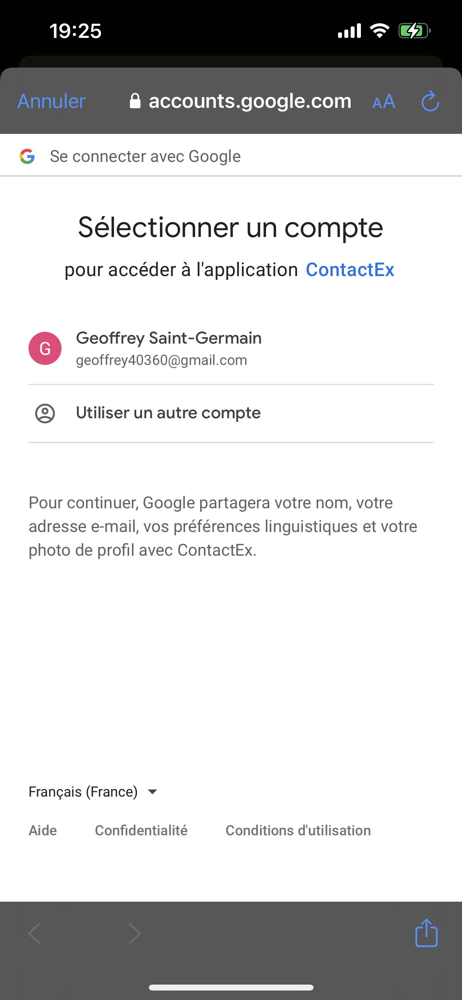
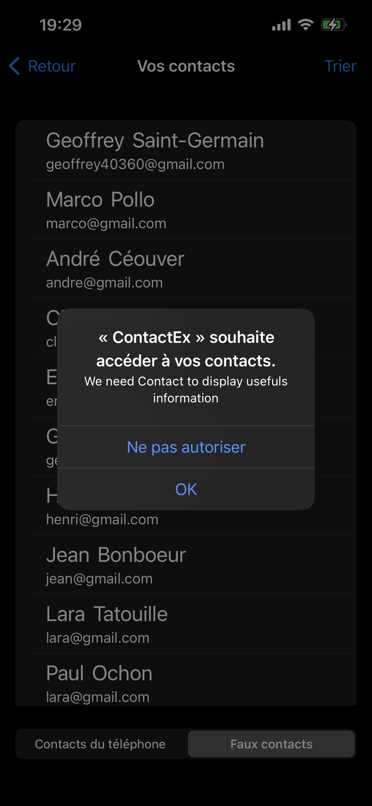
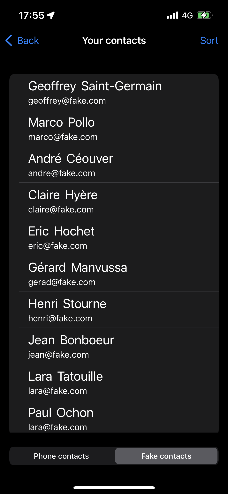
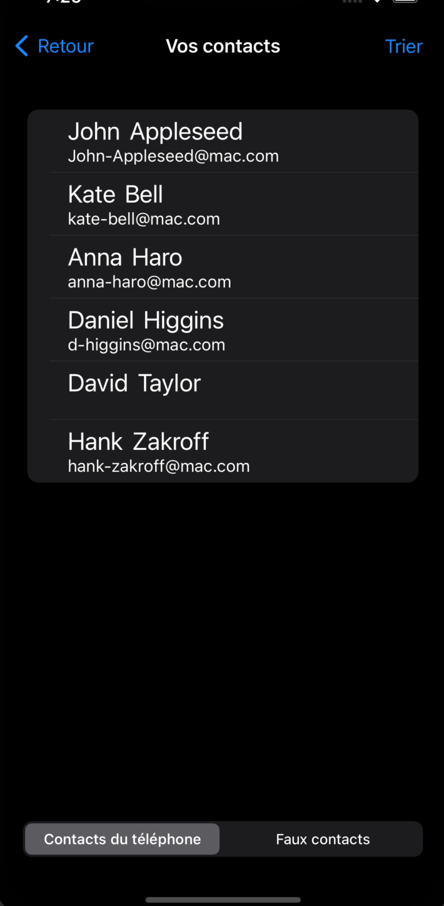
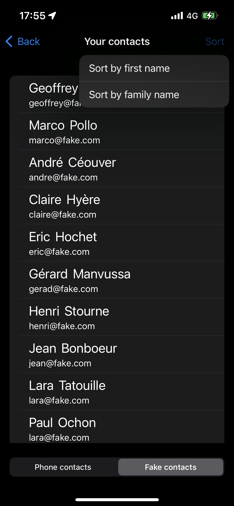
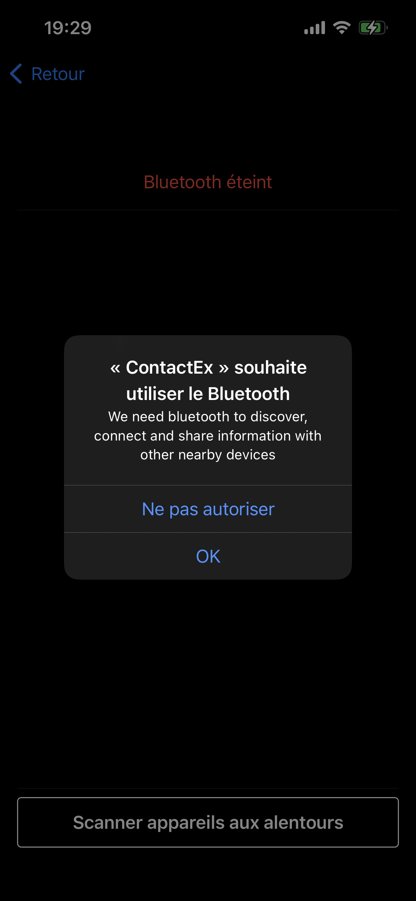
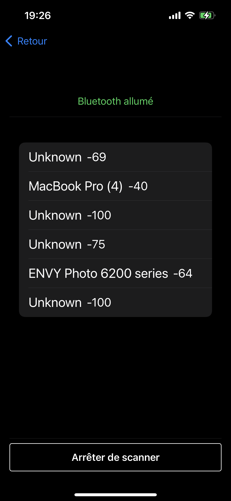

ContactEx
=========

'ContactEx' is a showCase app designed to display contacts, bluetooth peripherals and sign in with Google


* Authenticate with Google 
* Access phone contacts
* Also access fake contacts with data from json file
* Scan around bluetooth peripherals

It works with 'GoogleSignIn', 'GoogleSignInSwiftSupport', 'RxSwift', 'RxCocoa' modules import with Cocoa Pod.

----

# Getting Started

```
git clone https://github.com/GeoffreySaintGermain/TestContactRx.git
cd TestContactRx
pod install
open ContactEx.xcworkspace
```
----

# Usage

## Menu View

When the app start, 4 buttons are displayed

<br />

<br />

The Language button on top right corner allow user to change between french and english language

<br />

<br />

If Google Sign In button is clicked, the authentication flow start 

First the app ask for authorization to connect

<br />

<br />

Then the user can sign in with his account

<br />

<br />

If the user is successfully logged, the contact view appear

## Contact view

When the view appear, the app ask permissions to access contacts

<br />

<br />

Then display fake contacts from json file

<br />

<br />

User can select with the picker which contact to display and display phone contacts if he gave the permission

<br />

<br />

User can also sort contacts by first or last name

<br />

<br />

## Bluetooth view

When the view appear, the app ask permissions to access the bluetooth

<br />

<br />

When the button is tapped, the application start scanning and displaying around bluetooth devices

<br />

<br />


